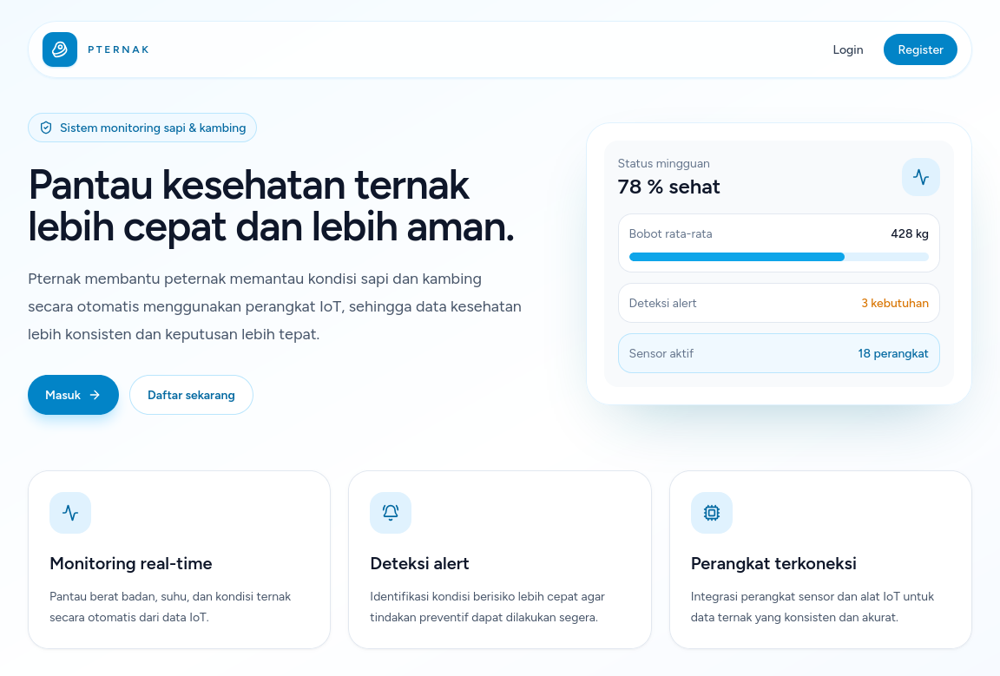
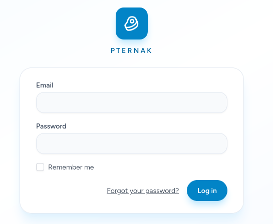
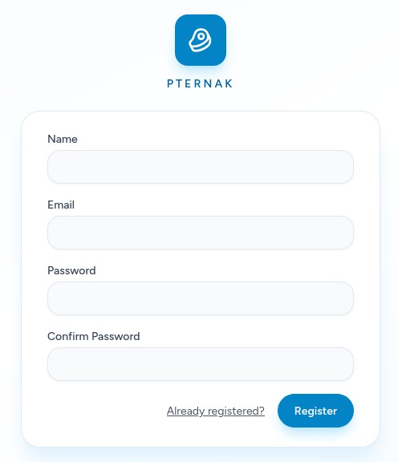
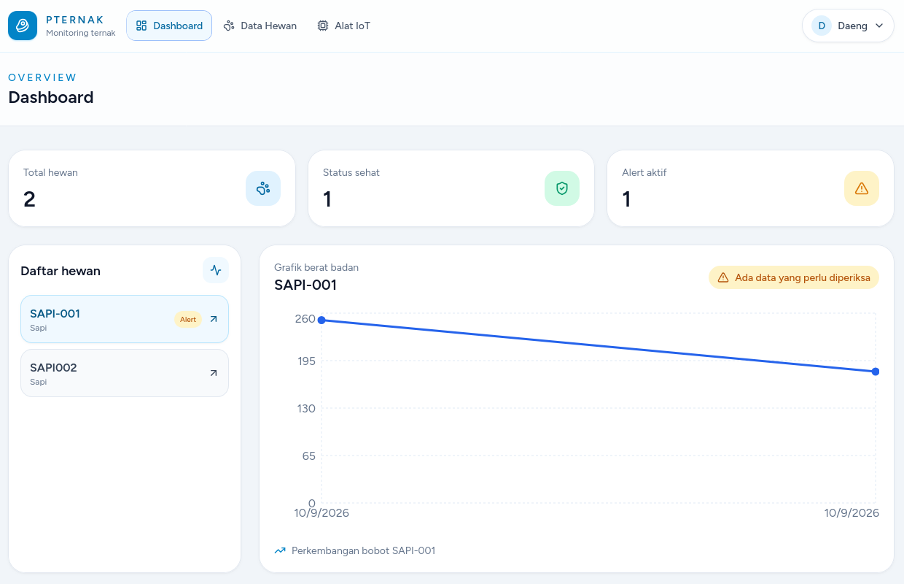
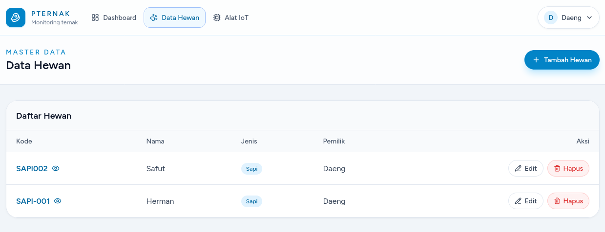
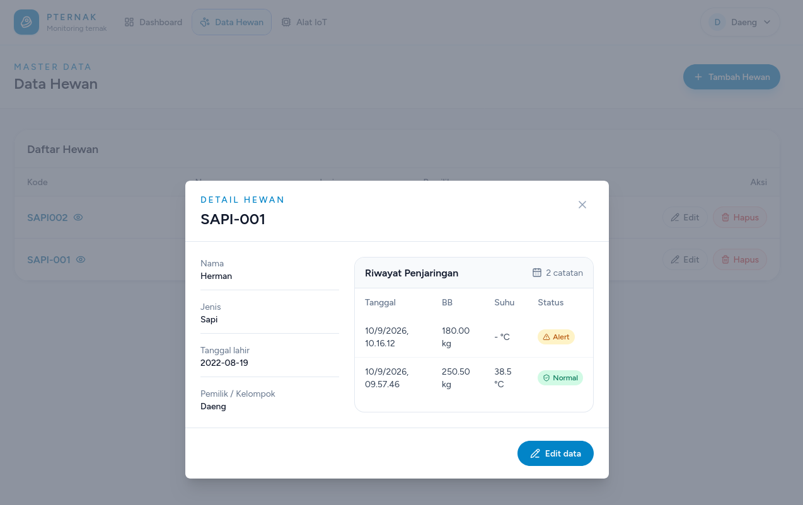
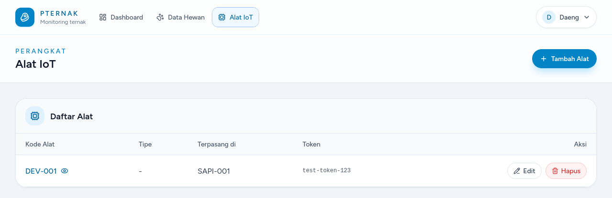

# Pternak

Pternak adalah sistem monitoring ternak berbasis web untuk membantu peternak memantau kondisi sapi dan kambing secara terpusat. Sistem ini menggabungkan dashboard kesehatan ternak, pengelolaan data hewan, perangkat IoT, serta riwayat penjaringan kesehatan.

## Teknologi

- Laravel 13
- Inertia.js
- React dengan TypeScript
- Tailwind CSS
- Recharts
- Lucide React
- MySQL atau SQLite

## Fitur Utama

- Dashboard ringkasan jumlah ternak, status sehat, dan alert aktif.
- Grafik perkembangan bobot berdasarkan riwayat penjaringan.
- CRUD data hewan dengan modal popup yang responsif.
- Detail hewan dan riwayat penjaringan kesehatan.
- CRUD perangkat IoT dan relasi perangkat dengan hewan.
- Deteksi status alert dari data kesehatan ternak.
- Autentikasi, pengaturan profile, dan pengelolaan password.
- Navigasi desktop dan bottom navigation untuk perangkat mobile.
- Endpoint API untuk menerima data penjaringan dari perangkat IoT.

## Tampilan Sistem

Screenshot berikut disusun sesuai alur penggunaan sistem.

### 1. Landing Page

Halaman awal yang memperkenalkan Pternak dan menyediakan akses login atau registrasi.



### 2. Login

Halaman autentikasi untuk pengguna yang sudah memiliki akun.



### 3. Register

Halaman pendaftaran akun pengguna baru.



### 4. Dashboard

Dashboard menampilkan ringkasan kondisi ternak dan grafik perkembangan bobot.



### 5. Data Hewan

Halaman pengelolaan data sapi dan kambing, termasuk aksi tambah, edit, detail, dan hapus melalui modal.



### 6. Detail Hewan

Detail profil hewan beserta riwayat penjaringan kesehatan, bobot, suhu, sumber data, catatan, dan status alert.



### 7. Alat IoT

Halaman registrasi dan pengelolaan perangkat IoT yang terhubung dengan ternak.



## Persyaratan Sistem

Pastikan perangkat sudah memiliki:

- PHP 8.2 atau lebih baru
- Composer
- Node.js dan npm
- Database MySQL atau SQLite

## Instalasi

1. Clone repository dan masuk ke folder project:

   ```bash
   git clone https://github.com/daengzah25/penelitian-iot.git
   cd penelitian-iot
   ```

2. Install dependency PHP:

   ```bash
   composer install
   ```

3. Install dependency frontend:

   ```bash
   npm install
   ```

4. Salin konfigurasi environment:

   ```bash
   cp .env.example .env
   php artisan key:generate
   ```

5. Atur koneksi database di file `.env`, kemudian jalankan migrasi:

   ```bash
   php artisan migrate
   ```

6. Jalankan server Laravel dan Vite:

   ```bash
   php artisan serve
   npm run dev
   ```

   Aplikasi dapat dibuka di `http://127.0.0.1:8000`.

## Build Production

Untuk membuat asset frontend production:

```bash
npm run build
```

## API Perangkat IoT

Perangkat IoT dapat mengirim data penjaringan melalui endpoint:

```text
POST /api/iot/health-checks
```

Gunakan token perangkat pada header autentikasi sesuai konfigurasi middleware aplikasi. Data yang dikirim digunakan untuk memperbarui riwayat kesehatan dan status alert hewan.

## Pengujian

Jalankan test backend dengan perintah:

```bash
php artisan test
```

## Lisensi

Project ini dikembangkan untuk kebutuhan penelitian dan pengembangan sistem monitoring ternak.
